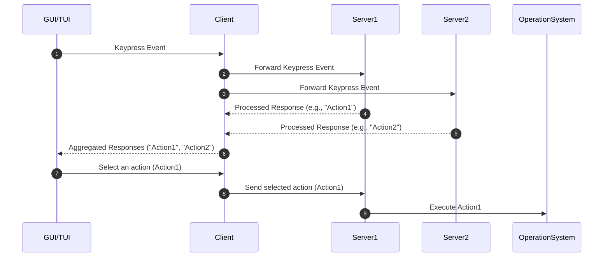

# Udokai - The launcher for unix-like systems

**THIS IS VERY MUCH A WORK IN PROGRESS.**

## Problem

At work I use MacOS and at home Linux (NixOs). I have to keep 2 configurations of the same kinda of tools (Alfred and Ulauncher).
I wanted to have an unique configuration and the same UX for both systems.  

Not to mention that versioning configuration for these tools is a pain, they weren't designed to be versioned.

Udokai idea is to be simple but extensible launcher, that uses a standard configuration language, like Toml/Yaml, which can be easily versioned and used in any unix-like system.
Its Architecture is heavily inspired by [pop-launcher](https://github.com/pop-os/launcher)

### Current Solutions

 - [Alfred](https://www.alfredapp.com/) MacOS only
 - [Raycast](https://raycast.com/) MacOS only
 - [Ulauncher](https://ulauncher.io/) Linux only
 - [Albert](https://albertlauncher.github.io/) Linux only
 - [onagre](https://github.com/onagre-launcher/onagre) Linux only (use pop-launcher as a backend)
 - rofi/wofi/dmenu - All linux only
 
Hopefully, this project will be a solution for me and for others that have the same need :)

## Architecture

[Architecture](https://excalidraw.com/#json=GmWGK8vX4JbHzk3Mue1ka,uMhpuff-yz6ABxDl2o4R6w)

### Sequence Diagram

The client and the server(s) process(es) will always be running in the background, to ensure its snapyness to respond to the user's input. The client will mutiplex the keypress events to the servers. The servers will process the keypress events and return a list of items to the client. The client will aggregate the responses and display them to the user. The user will select an item and the client will send the command to the server to execute the action. 



### Open questions and problems to solve

On the context of the launcher a *plugin* will run a server that will be connected to the client. Allowing developers to create their own plugins to extend the launcher.

    - How to make the plugins discoverable? or should they be configurable?
    - How to translate the commands to the OS? (e.g., open an application, open a file, etc)
     * Maybe each plugin server will be responsible to translate, or work on a specific OS only
    - How to handle the aggregation of the responses from the servers?


## TODOs / FEATURES

- [x] Implement a basic client/server communication using UnixSocket
- [x] Implement a basic TUI using ratatui for testing on the terminal
- [x] Communication between TUI and Client via Stdin/Stdout
- [ ] Actor model for the client and servers to supervise the processes
   Options:
    - https://github.com/actix/actix 
      docs - https://actix.rs/docs/actix/actor/
    - https://github.com/slawlor/ractor
      docs - https://slawlor.github.io/ractor/quickstart/
- [ ] Handle server responses aggregation and display
- [ ] Handle client command to server (selecting an item)
- [ ] Implement a basic GUI using iced to use as the main interface
- [ ] Implement protocol of communication between client and server
    - [ ] Implement protocol for server to register triggers
    - [ ] Implement protocol for client to send user input
    - [ ] Implement protocol for server to respond with a list of items
    - [ ] Implement protocol for client to send command to server to execute
- [ ] Implement protocol for client to discover servers running dynamically (config? auto-discovery?)


### Default Servers

- [ ] Implement a server that return the list of Applications installed on the system
- [ ] Implement a server that return the list of files in a directory
- [ ] *Implement a server that return the list of Bluetooth devices and connect/disconnect to them

* Maybe

### DX

- [ ] Implement a way to run the client and servers in the background for testing
- [ ] Implement a integration test suite

## Development Environment

There are 3 main process in this project: UI(main), Client, and Server. The UI is responsible for rendering the user interface, the client is responsible for forwarding the user's input to the server processes, and the server processes are responsible for processing the user's input and returning a list of items.

They log to log files in /tmp/{name}.log directory. When working on the project, you can run the following commands to see the logs:

Recommend running `tail` in a separate terminal window to see the logs in real-time.

```bash
# First terminal
tail -f /tmp/ui.log

# Second terminal
tail -f /tmp/client.log

# Third terminal
tail -f /tmp/server1.log
```

Then in another terminal, you can run the following commands to start the processes:

```bash
make run
```
