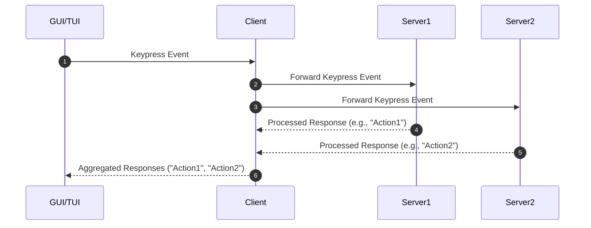

# Development

[Architecture](https://excalidraw.com/#json=kd7hKMw5Shu1wK_RhW9MW,R5Kt7fCOiAZ_w3l80mingg)

## Sequence Diagram

The client and the server process will always be running in the background, to ensure it's snap to respond to the user's input. The client will forward the user's input to the server processes, and the server processes which if matches their trigger will respond with a list of items. The client is responsible for aggregate the responses



## Development Environment

There are 3 main process in this project: UI(main), Client, and Server. The UI is responsible for rendering the user interface, the client is responsible for forwarding the user's input to the server processes, and the server processes are responsible for processing the user's input and returning a list of items.

They log to log files in /tmp/{name}.log directory. When working on the project, you can run the following commands to see the logs:

Recommend running `tail` in a separate terminal window to see the logs in real-time.

```bash
# First terminal
tail -f /tmp/ui.log

# Second terminal
tail -f /tmp/client.log

# Third terminal
tail -f /tmp/server1.log
```

Then in another terminal, you can run the following commands to start the processes:

```bash
make run
```
